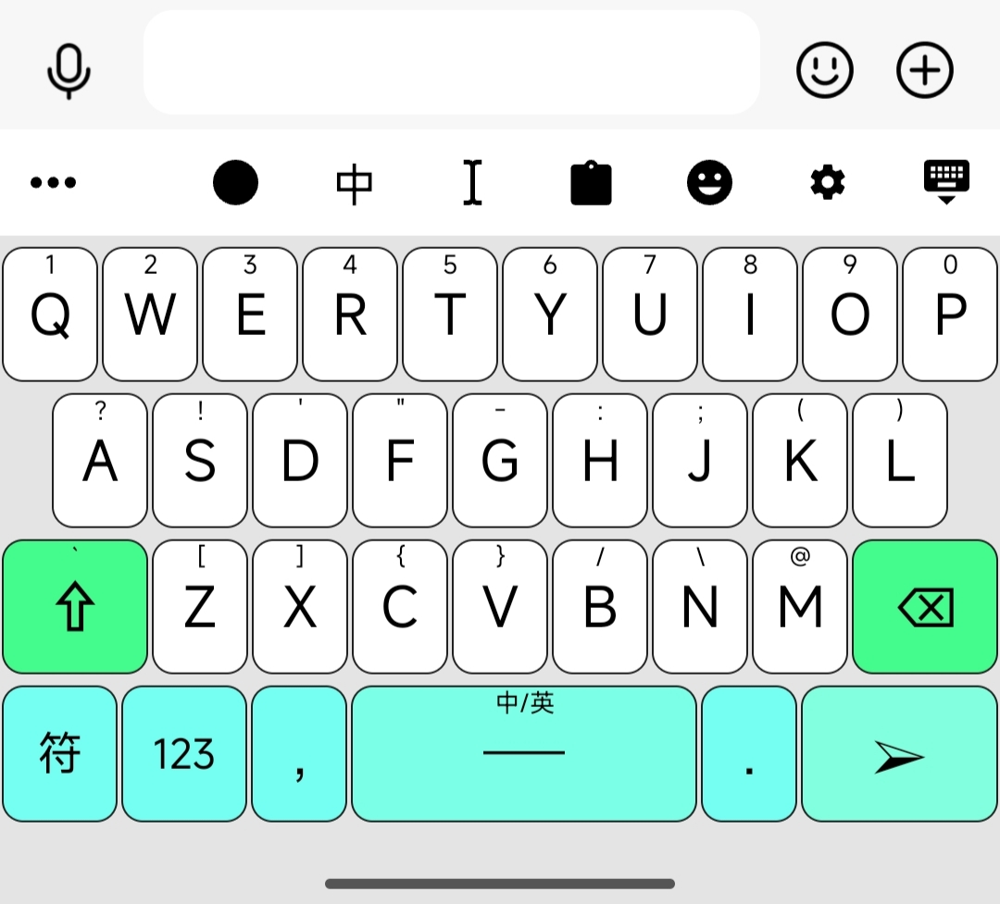
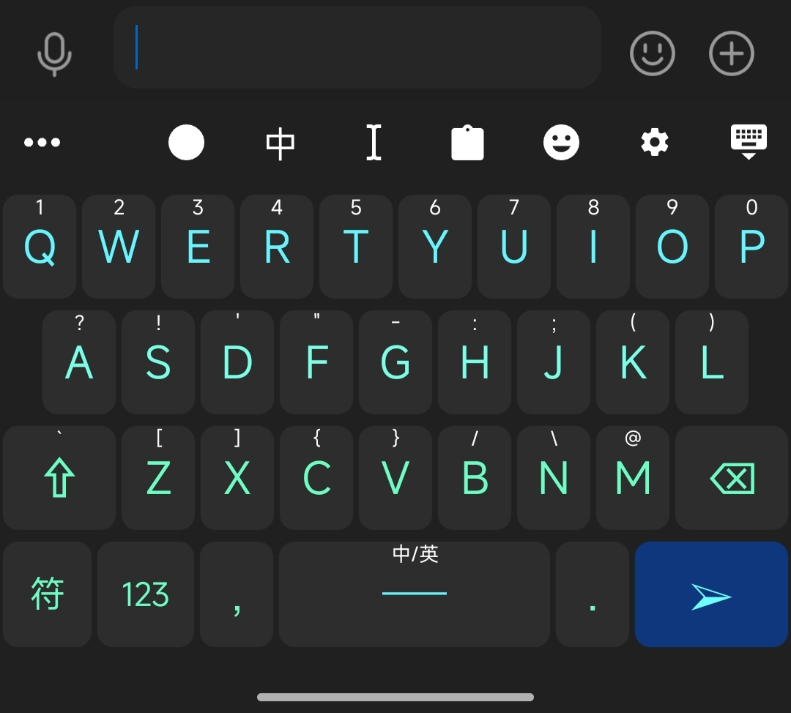

# Trime 配置

Rime 输入法自定义配置，基于万象拼音 pro。

## 功能特性

- 默认启用万象拼音 pro 输入方案
- 添加常见模糊拼音支持（en ↔ eng, in ↔ ing）
- 开启字词预测功能，默认显示 5 个候选词
- 提供 Ice Mint 双模式主题，自动适配系统深色/浅色

## 按键行为

修改了以下默认按键行为：
- Caps Lock：清除已有输入
- 左右 Shift：无操作
- 左右 Ctrl：确认当前编码
- Ctrl + 句号：切换中英文标点

## 使用方式

1. 将 `patch` 文件夹内的所有文件复制到 Rime 用户文件夹
2. 将 `skin/Ice_Mint.trime.yaml` 复制到 Rime 用户文件夹
3. 重新部署 Rime 生效

## 主题预览

浅色模式：

深色模式：

## 鸣谢

- 皮肤预览和编辑工具：[edit4trime](https://hero20072.github.io/edit4trime/)
- Rime 输入法官方：[rime.im](https://rime.im/)
- 皮肤灵感来源：[chwt163/mytrime](https://github.com/chwt163/mytrime)
